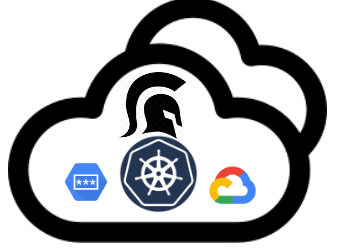

<p align="center">
    
</p>

# cloud-army-secret-admission-controller


 
This is a [Kubernetes admission controller] to be used as a mutating admission webhook to add a container-init with a custom binary that extract secrets from GCP Secret Manager and to push this secrets to the container entrypoint sub-process. This solution can be used to compliance with the CIS Kubernetes Benchmark v1.5.1 specially with the control id: 5.4.1 (no-secrets-as-env-vars).

## Requirements

- Google Kubernetes Engine (GKE) with Workload Identity enabled and binding between KSA and GSA (_view K8S references_).

>NOTE: Make sure that the GSA have ```roles/secretmanager.secretAccessor``` IAM Role assigned.

- Cert-manager controller should be installed on Kubernetes GKE (_view K8S references_) 

- Ensure you have the ```admission-webhook=enabled``` *label* in the namespace where you want to run your applications (*)


## **Installation:**

## Deploy Admission Webhook
To configure the cluster to use the admission webhook and to deploy said webhook, run the nexts installation steps:
```
helm repo add cloud-army https://cloud-army.github.io/helm-charts

helm install cloud-army-secret-injector cloud-army/cloud-army-secret-injector

```
### _🚨 IMPORTANT NOTE: Cert-manager controller should be installed in your cluster (view K8S references) 🚨_

Then, make sure the admission webhook resources are correctly configured (in the `mutator` namespace):
```
NAME                                           READY   STATUS    RESTARTS   AGE
pod/carmy-kubernetes-webhook-87c777467-rkc9s   1/1     Running   0          35s
pod/carmy-kubernetes-webhook-87c777467-wqztv   1/1     Running   0          35s

NAME                               TYPE        CLUSTER-IP     EXTERNAL-IP   PORT(S)   AGE
service/carmy-kubernetes-webhook   ClusterIP   10.192.49.76   <none>        443/TCP   36s

NAME                                       READY   UP-TO-DATE   AVAILABLE   AGE
deployment.apps/carmy-kubernetes-webhook   2/2     2            2           36s

NAME                                                 DESIRED   CURRENT   READY   AGE
replicaset.apps/carmy-kubernetes-webhook-87c777467   2         2         2       36s

```
## **Usage:**

## Deploying pods
Build and Deploy a test pod that gets secrets from GCP Secret Manager and print its in the pod console. 

ℹ️ (*) Remember that: The namespace where running the applications should be labeled with ```admission-webhook: enabled```:
```bash
kubectl label namespaces [applications_namespace] admission-webhook=enabled
```
🚀 Building and Deploying a test pod...
```bash
kubectl apply -f manifests/pods-example/pod-example.yaml
```
pod/envserver created

```yaml
apiVersion: apps/v1
kind: Deployment
metadata:
  name: envprinter
spec:
  replicas: 1
  selector:
    matchLabels:
      app: envprinter
  template:
    metadata:
      labels:
        app: envprinter
    spec:
      containers:
      - name: envprinter
        image: # docker image of your application here
        imagePullPolicy: Always
        command: ["entrypoint.sh"] # Use entrypoint.sh command as a standard name
```

### _🚨 IMPORTANT NOTE: Only for test, you should create a docker image with a simple entrypoint that use printenv & sleep with time in seconds, a ```envsecrets-config.json``` file, and running the pods using Workload Identity🚨_

About the ```envsecrets-config.json``` file, it is the place were declaring the GCP Secrets resources that you need consume, and it's his estructure is:

```json
{
    "secrets":[
        {
            "env":"",
            "name":"projects/GCP_PROJECT_NUMBER/secrets/GCP_SECRET_NAME/versions/latest"
        }
    ],
    "config":
        {
            "convert_to_uppercase_var_names": true
        }
}
```

For more information about the ```envsecrets-config.json``` file, check this repo https://github.com/cloud-army/envsecrets


## Security Controls Compliance

CIS Google Kubernetes Engine (GKE) Benchmark v1.5.1 controls:

- 5.4.1 Prefer using secrets as files over secrets as environment variables

>NOTE: Handle secrets as environment variables inside a container is also a bad practice, this method enables to handle the secrets as a environment variable for **ONLY** the **PID** of the running application, wich is more secure for every runtime application.

- 6.2.2 Prefer using dedicated GCP Service Accounts and Workload Identity 


## **Contributing:**

<p dir="auto">Please see the <a href="https://github.com/cloud-army/secret-mutator-admission-webhook/blob/main/CONTRIBUTING.md">contributing
guidelines</a>.</p>

## **License:**

<p dir="auto">This library is licensed under Apache 2.0. Full license text is available in
<a href="https://github.com/cloud-army/secret-mutator-admission-webhook/blob/main/LICENSE">LICENSE</a>.</p>

## **K8S references:**

- https://github.com/GoogleCloudPlatform/berglas/tree/main/examples/kubernetes

- https://www.sobyte.net/post/2023-01/cert-manager-admission-webhook/

- https://cloud.google.com/secret-manager/docs/access-control

- https://cert-manager.io/docs/troubleshooting/webhook/

- https://cert-manager.io/docs/installation/helm/

- https://cloud.google.com/anthos-config-management/docs/how-to/using-cis-k8s-benchmark

- https://cloud.google.com/kubernetes-engine/docs/how-to/workload-identity?hl=es-419

- https://www.cisecurity.org/benchmark/kubernetes

